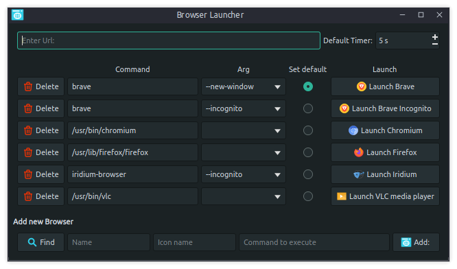
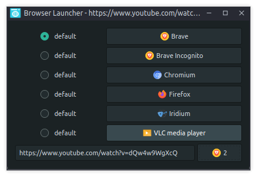

# Browser Launcher
A simple app to choose which browser to use or launch with different arguments.

Should be set as default browser.

Test it with [Appimage](https://github.com/slidinghotdog/browser-launcher/releases/download/0.1/Browser_Launcher-x86_64.AppImage).

### Edit view:
Start the app without arguments to edit browser list (on first launch it will search `/usr/share/applications` for apps that have MimeType: `text/html`)

Add arguments or add the same browser if u need to launch it with different arguments.

Tip: You can add other apps that can open urls like VLC for youtube videos (need to remove `/usr/lib/vlc/lua/playlist/youtube.luac` and then save [this](https://github.com/videolan/vlc/blob/master/share/lua/playlist/youtube.lua) file in the same folder or in `~/.local/share/vlc/lua/playlist/` due to youtube changes)



### Launcher view:
Start the app with url to open Launcher eg: `browser-launcher www.example.com`, if set as default browser it will open urls you click with this view.
It has a countdown timer that launches the default browser if you don't choose before it reaches zero.



### Install from source:

Debian/Ubuntu: `sudo apt install -y git build-essential qt5-default`


```
git clone https://github.com/slidinghotdog/browser-launcher.git
cd browser-launcher
./install.sh
```
